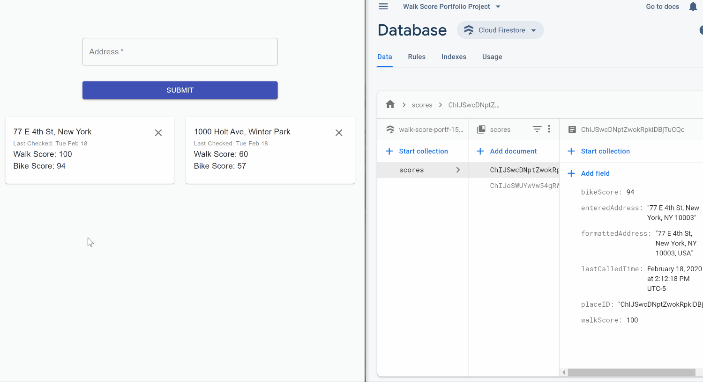

# Walk Score

Find and Compare Public Transit & Walkability Scores, enter your address to get your score.



API Calls to Google Maps Geocoding API and Walk Score API, Firestore for realtime database. Integrated ESLint with Airbnb Style Guide.

## Usage
1. Clone repository and run in terminal:
```
cd server
npm install
node server.js
```
2. In main directory, open client with:
```
cd client
npm install
npm start
```
3. Enter in an address to recieve its Walk Score and Bike Score.
